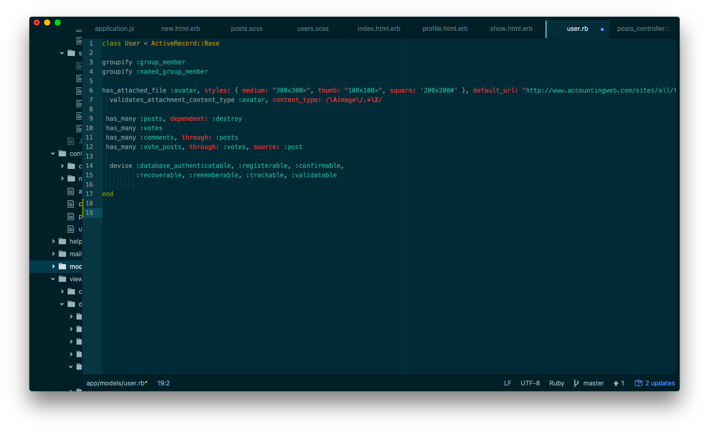
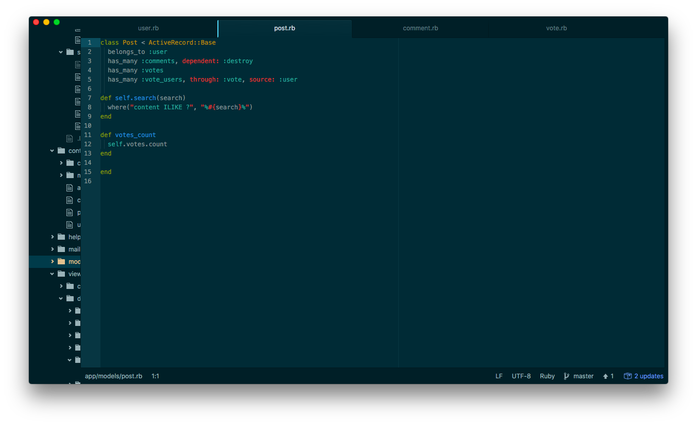
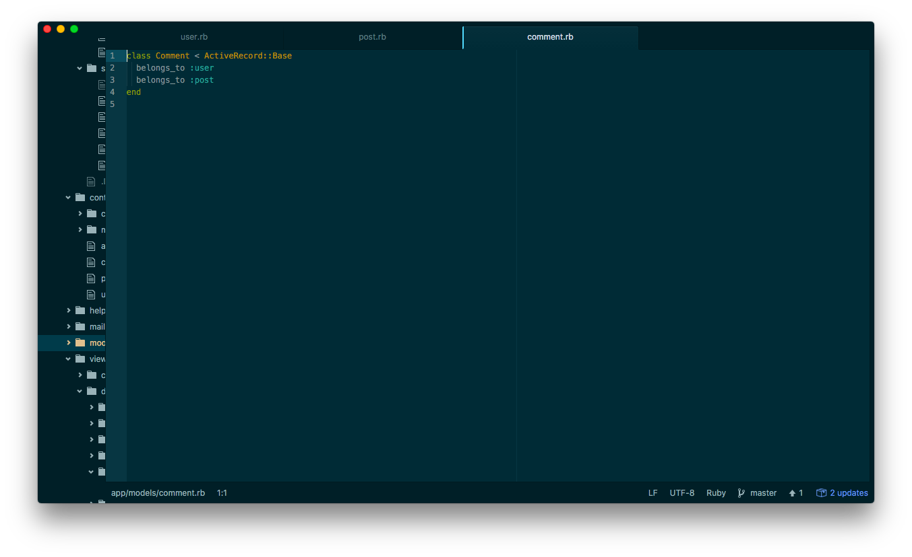
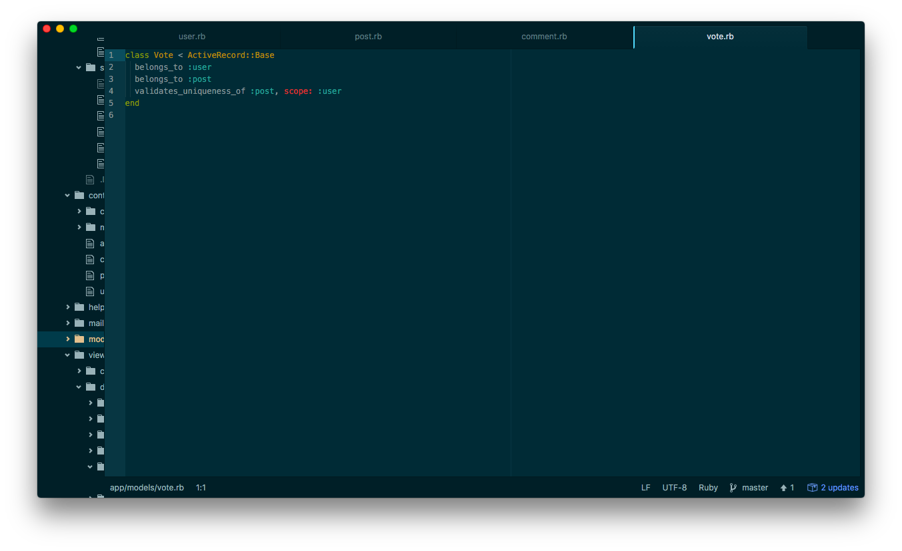

##Trabajo

### By Bonnie, Christy, Kelly and Zolon
**Trabajo** is a ruby on rails app built for General Assembly's Web Development Immersive. 

### Technologies Used
We used **Ruby on Rails**, **Sass**, and **jQuery**

### Screen Shots

# Models

